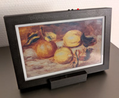
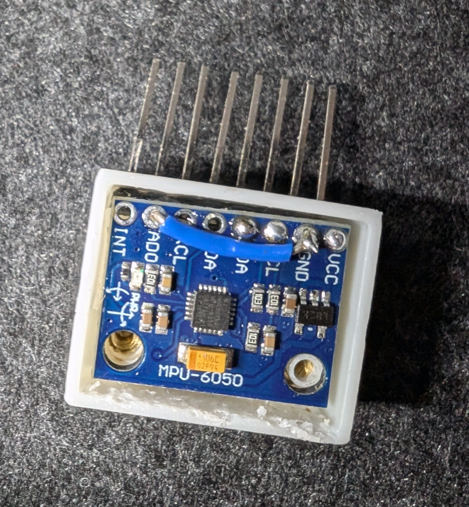
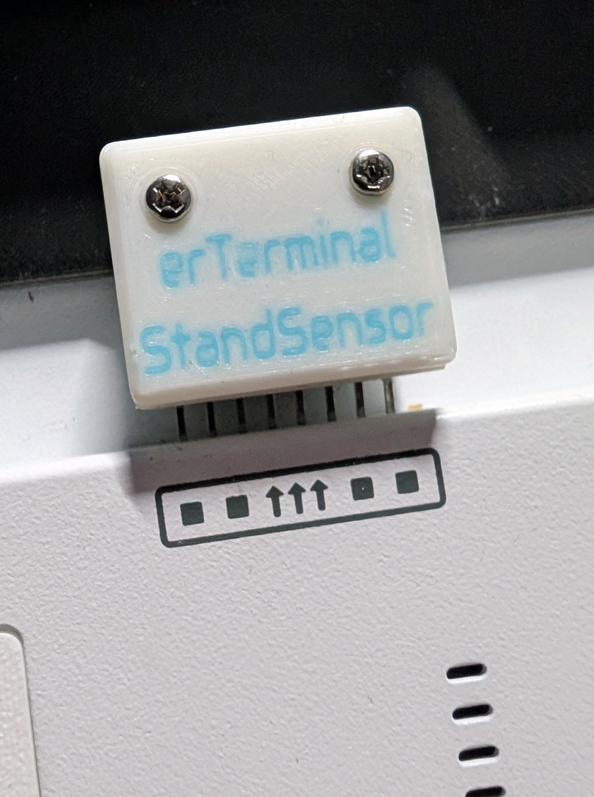
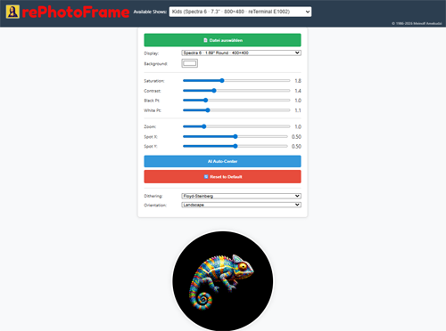

<center>
  
  <br>
  
</center>
<br><br>

# µPhotoFrame™ - WiFi-based E-Ink Photo Frame for reTerminal

**An intelligent, remote-controlled photo frame firmware for reTerminal E1001 (Grayscale) & E1002 (Full Color)**

---

## 🌍 Languages / Sprachen

- [English](#english)
- [Deutsch](#deutsch)

---

<a name="english"></a>
## 📖 English

### ⚠️ Project Status
**Currently in active development...**

### ✨ Features

This project includes photo frame firmware for the reTerminal E1001/E1002, as well as a server application for managing and preparing photo albums with several special features:

#### 🖼️ Display Support
- ✅ **reTerminal E1001:** 7.5" Grayscale (4-Level)
- ✅ **reTerminal E1002:** 7.3" Spectra 6 (Full Color)
- ✅ **Auto-Rotation:** MPU6050 sensor support for automatic orientation detection
- ✅ **Low Power:** Optimized for E-Ink displays with configurable rest periods

#### 📡 WiFi Management
- ✅ Remote management via web interface
- ✅ Multiple image lists with remote switching
- ✅ Automatic time synchronization
- ✅ Easy WiFi configuration via access point

#### 🎨 Image Processing
- ✅ Fully automated image processing in browser
- ✅ AI-powered cropping (TensorFlow.js / COCO-SSD via CDN when online — see `docs/BUILD_INSTALLER.md`)
- ✅ Extreme compression with highest quality
- ✅ Support for both landscape and portrait formats
- ✅ Custom `.ink` format for optimal storage (mimetype image/ink)

#### ⏱️ Flexible Timing
- ✅ Display duration: 1 minute to 6 hours per image list
- ✅ Configurable rest periods to preserve battery
- ✅ Different modes: sequential, reverse, or random

#### 💾 Storage
- ✅ SD card support for offline operation
- ✅ Store 2-5 million images on a 2TB SD card
- ✅ Import/Export functionality for image lists
- ✅ No database server required (JSON-based)

#### 🎛️ User Controls
- ✅ Hardware buttons for next/previous image
- ✅ Mode selection via buttons
- ✅ WiFi reconfiguration (hold both buttons for 1 second)
- ✅ Low battery warning display

### 🚀 Quick Start

#### 1. Flash Firmware
The easiest way for end users:

**👉 [Open Web Flasher](https://mamekudz.github.io/microPhotoFrame/firmware/flasher.html)**

1. Connect reTerminal via USB
2. Click "Firmware Installieren"
3. Select COM port
4. Wait until complete (~2 minutes)

More options: [Firmware README](firmware/README.md)

#### 2. Setup Server

```bash
# Clone repository
git clone https://github.com/mamekudz/microPhotoFrame.git
cd microPhotoFrame

# Setup IIS or Apache as web server
# Point webroot to project directory

# Or for development:
npx http-server -p 8080
```

#### 3. Configure Device

After first boot:

1. Connect to WiFi **"microPhotoFrame"**
2. Open browser: `http://192.168.4.1`
3. Enter WiFi credentials
4. Specify server URL (e.g., `http://192.168.0.107:888`)
5. Save and restart

### 🛠️ Hardware Expansion

**MPU6050 Acceleration Sensor (Optional)**

Add automatic orientation detection with 3D-printed case:
- 📐 [Build Instructions & 3D Files](https://makerworld.com/en/@amekudzi)
- 🎯 Automatic landscape/portrait detection
- 🔄 Instant image switching on rotation

<br>
<center>
  
</center>
<br>

### 📚 Documentation

- **[Firmware README](firmware/README.md)** - Detailed firmware documentation
- **[ink-encoder Package](ink-encoder/README.md)** - NPM package documentation
- **[Technical Overview](docs/technical_overview.md)** - Architecture and design
- **[.ink orientation on PC](docs/INK_ORIENTATION_PC.md)** - Portrait encode vs. Windows preview (no mirror)
- **[Server Setup](docs/)** - IIS, Apache, NGINX, Node.js guides

### 🛠️ Development Gulp tasks (µGulp™)

<p align="center">
  <a href="https://microgulp.dev/en/ready/">
    
  </a>
</p>

The badge applies to **this repository’s development/build Gulp tasks**, not to the device firmware.

These tasks are **repository development/build helpers**. They do not flash or certify the device firmware.

The gulpfile is prepared for [µGulp™](https://microgulp.dev/en/): `µParameters` forms (`BUILD_SERVER_PACKAGES`, `ENCODE_INK`, `BACKUP_TO_NAS`), task-reported progress (`CreateProgress` / `ReportProgress`), a `LogTable` artifact listing after server packages, and `µWatch` on firmware sources, favicon PNGs and branding copies. Display names and groups are i18n’d via `i18x/gulp/`. This is maintainer self-certification against the published [µGulp™ Ready](https://microgulp.dev/en/ready/) requirements, not an independent audit.

**Prerequisites:** Node.js 22+, `npm install` in the repo root (workspace package `ink-encoder/` 2.0.0 is linked automatically). Windows for `BACKUP_TO_NAS` (robocopy) and NSIS installer builds. PlatformIO (`pio`) for firmware tasks. `gulp-mu-gulp-api` is a devDependency. A neighbor checkout of `../ink-encoder` is **not** required. Config fallback `./config/ink-encode-config.json` is not in the repo — use `config/ink-encode-config.example.json` or a local copy.

**CLI (plain Gulp does not apply `µParameters` defaults).** Set `MICROGULP_PARAM_<ID>` or `MICROGULP_PARAMS` JSON, or use the task-coded fallbacks below:

| Command | Inputs / defaults | Result |
| :--- | :--- | :--- |
| `npx gulp --tasks` | — | Lists exported task names |
| `npx gulp COPY_RAWMEDIA_WEBASSETS` | none | Copies `rawmedia/Logo.png` and `LogoText.png` to `webassets/` when present |
| `npx gulp BUILD_SERVER_PACKAGES` | `MICROGULP_PARAM_SERVERTYPE=node\|iis\|apache\|nginx\|all`. Without it the CLI may prompt (`RequestSelectInput`, default `all` on that prompt). The `µParameters` default is **not** applied automatically. | Zip(s) in `dist/` |
| `npx gulp BUILD_ALL_SERVER_PACKAGES` | none | All four zips in `dist/` |
| `npx gulp ENCODE_INK` | **required** `MICROGULP_PARAM_INPUT` or `input`; optional `MICROGULP_PARAM_OUTPUT` / `MICROGULP_PARAM_CONFIG` (code fallback `./config/ink-encode-config.json`, not shipped; example: `./config/ink-encode-config.example.json`) | `.ink` files |
| `npx gulp COMMIT_INK_ENCODER` | **required** `MICROGULP_PARAM_MESSAGE` and `MICROGULP_PARAM_CONFIRM=true` | git commit of `ink-encoder/` only (no push; other staged files are ignored via `git commit --only`) |
| `npx gulp PUBLISH_INK_ENCODER` | CLI **dry-run by default**. Real upload: `MICROGULP_PARAM_DRYRUN=false` and `MICROGULP_PARAM_CONFIRM=true`. Optional `MICROGULP_PARAM_OTP`, `MICROGULP_PARAM_SKIPTESTS=true` | `npm publish` of the workspace package only (not PhotoFrame) |
| `npx gulp BACKUP_TO_NAS` | Destination: `MICROGULP_PARAM_DESTINATION` or `MICROPHOTOFRAME_NAS_BACKUP`, else the **code** fallback `Z:\Projects\microPhotoFrame` (that folder must already exist) | robocopy `/MIR` mirror |

**NAS backup is a mirror with deletions, not a versioned backup.** Extra files on the destination are removed. Regenerable trees (`node_modules`, `dist`, `tmp`, `.pio`, …) are not copied; leftovers with those names are deleted **inside the destination only**. `lib` / `build` are excluded only as project-root (and `firmware/lib`) paths so vendored `src/libs` is kept. Drive/share roots and destinations that are the project folder, a parent, or a child of it are refused. Junctions/symlinks that point outside the destination are not followed for deletion.

`npx gulp FIRMWARE_BUILD` / `FIRMWARE_UPLOAD` / `FIRMWARE_MONITOR` wrap PlatformIO. `µWatch` is dashboard-only; on the CLI run the task again after edits.

**Checked on 2026-09-18** (this workstation: Windows 10.0.22631, Cursor, Node v22.19.0, gulp 5.0.1, gulp-mu-gulp-api 0.4.2, µGulp™ 0.9.5): HTTP dashboard (`microgulp-serve --http`) `ENCODE_INK` parameter form, successful synthetic PNG→`.ink` (`DONE 100%`, visible log), and a missing-file failure (`No files found`). CLI the same day: `MICROGULP_PARAM_INPUT`/`OUTPUT`/`CONFIG` success and missing-input abort. `node --test tools/nas-backup.test.mjs`. **Not claimed as tested here:** µWatch arming, `LogTable` after server packages, firmware flash, live NAS backup, `npm publish`.

### 🎁 Included Content

The project includes a sample image list with classic paintings (~100 images, 1 MB).

### 📄 License

MIT License - see [LICENSE](LICENSE) for details

---

<a name="deutsch"></a>
## 📖 Deutsch

# µPhotoFrame™ - WiFi-basierter E-Ink-Fotorahmen für reTerminal

**Intelligente, ferngesteuerte Bilderrahmen-Firmware für reTerminal E1001 (Graustufen) und E1002 (Vollfarbe)**

---

### ⚠️ Projektstatus
**Aktuell noch in aktiver Entwicklung...**

### ✨ Funktionen

Dieses Projekt enthält eine Fotorahmen-Firmware für das reTerminal E1001/E1002, sowie eine Server-Applikation für die Verwaltung und Aufbereitung von Fotoalben mit einigen Besonderheiten:

#### 🖼️ Display-Unterstützung
- ✅ **reTerminal E1001:** 7,5" Graustufen (4-Level)
- ✅ **reTerminal E1002:** 7,3" Spectra 6 (Vollfarbe)
- ✅ **Auto-Rotation:** MPU6050 Sensor für automatische Orientierungserkennung
- ✅ **Stromsparend:** Optimiert für E-Ink Displays mit konfigurierbaren Ruhezeiten

#### 📡 WiFi-Verwaltung
- ✅ Fernverwaltung über Weboberfläche
- ✅ Mehrere Bildlisten mit Fernumschaltung
- ✅ Automatische Zeitsynchronisation
- ✅ Einfache WiFi-Konfiguration über Access Point

#### 🎨 Bildverarbeitung
- ✅ Vollautomatische Bildaufbereitung im Browser
- ✅ KI-gestützter Zuschnitt (TensorFlow.js / COCO-SSD per CDN bei Online — siehe `docs/BUILD_INSTALLER.md`)
- ✅ Extreme Kompression bei höchster Qualität
- ✅ Unterstützung für Quer- und Hochformat
- ✅ Eigenes `.ink` Format für optimale Speicherung (mimetype image/ink)

#### ⏱️ Flexible Zeitsteuerung
- ✅ Anzeigedauer: 1 Minute bis 6 Stunden pro Bildliste
- ✅ Konfigurierbare Ruhezeiten zur Akkuschonung
- ✅ Verschiedene Modi: fortlaufend, rücklaufend oder zufällig

#### 💾 Speicherung
- ✅ SD-Karten-Support für Offline-Betrieb
- ✅ 2-5 Millionen Bilder auf 2TB SD-Karte speicherbar
- ✅ Import/Export-Funktion für Bildlisten
- ✅ Kein Datenbank-Server erforderlich (JSON-basiert)

#### 🎛️ Bedienelemente
- ✅ Hardware-Tasten für nächstes/vorheriges Bild
- ✅ Modus-Auswahl über Tasten
- ✅ WiFi-Neukonfiguration (beide Tasten 1 Sekunde halten)
- ✅ Akkustand-Warnung bei niedrigem Ladestand

### 🚀 Schnellstart

#### 1. Firmware Flashen
Der einfachste Weg für Endanwender:

**👉 [Web-Flasher öffnen](https://mamekudz.github.io/microPhotoFrame/firmware/flasher.html)**

1. reTerminal via USB verbinden
2. "Firmware Installieren" klicken
3. COM-Port auswählen
4. Warten bis fertig (~2 Minuten)

Weitere Optionen: [Firmware README](firmware/README.md)

#### 2. Server einrichten

```bash
# Repository klonen
git clone https://github.com/mamekudz/microPhotoFrame.git
cd microPhotoFrame

# IIS oder Apache als Webserver einrichten
# Webroot auf Projektverzeichnis zeigen

# Oder für Entwicklung:
npx http-server -p 8080
```

#### 3. Gerät konfigurieren

Nach dem ersten Start:

1. Mit WiFi **"microPhotoFrame"** verbinden
2. Browser öffnen: `http://192.168.4.1`
3. WLAN-Zugangsdaten eingeben
4. Server-URL angeben (z.B. `http://192.168.0.107:888`)
5. Speichern und neu starten

### 🛠️ Hardware-Erweiterung

**MPU6050 Beschleunigungssensor (Optional)**

Fügen Sie automatische Orientierungserkennung mit 3D-gedrucktem Gehäuse hinzu:
- 📐 [Bauanleitung & 3D-Dateien](https://makerworld.com/en/@amekudzi)
- 🎯 Automatische Quer-/Hochformat-Erkennung
- 🔄 Sofortiger Bildwechsel bei Drehung

<br>
<center>
  
  <br><br>
  
</center>
<br>

<center>
  
</center>
<br>

### 📚 Dokumentation

- **[Firmware README](firmware/README.md)** - Detaillierte Firmware-Dokumentation
- **[ink-encoder Paket](ink-encoder/README.md)** - NPM-Paket Dokumentation
- **[Technische Übersicht](docs/technical_overview.md)** - Architektur und Design
- **[.ink Orientierung am PC](docs/INK_ORIENTATION_PC.md)** - Hochkant in Firmware vs. Vorschau (ohne Spiegelung)
- **[Server-Setup](docs/)** - IIS, Apache, NGINX, Node.js Anleitungen

### 🛠️ Entwicklungs-Gulp-Tasks (µGulp™)

<p align="center">
  <a href="https://microgulp.dev/en/ready/">
    
  </a>
</p>

Das Badge gilt für die **Entwicklungs-/Build-Gulp-Tasks dieses Repositories**, nicht für die Gerätefirmware.

Diese Tasks sind **Entwicklungs-/Build-Helfer dieses Repositories**. Sie flashen die Gerätefirmware nicht und sind keine Gerätezertifizierung.

Das Gulpfile ist für [µGulp™](https://microgulp.dev/de/ready/) vorbereitet: `µParameters`-Formulare (`BUILD_SERVER_PACKAGES`, `ENCODE_INK`, `BACKUP_TO_NAS`), gemeldeter Fortschritt (`CreateProgress` / `ReportProgress`), `LogTable` nach Serverpaketen sowie `µWatch` für Firmware-Quellen, Favicon-PNGs und Branding-Kopien. Anzeigenamen liegen unter `i18x/gulp/`. Das ist Maintainer-Selbstdeklaration gemäß den veröffentlichten [µGulp™-Ready-Anforderungen](https://microgulp.dev/en/ready/), keine unabhängige Prüfung.

**Voraussetzungen:** Node.js 22+, `npm install` im Projektroot (Workspace-Paket `ink-encoder/` 2.0.0 wird automatisch verknüpft). Windows für `BACKUP_TO_NAS` (robocopy) und NSIS-Installer. PlatformIO (`pio`) für Firmware-Tasks. `gulp-mu-gulp-api` ist eine devDependency. Ein Nachbar-Checkout von `../ink-encoder` ist **nicht** nötig. Der Config-Fallback `./config/ink-encode-config.json` liegt nicht im Repo — `config/ink-encode-config.example.json` oder eine lokale Kopie verwenden.

**CLI (gewöhnliches Gulp übernimmt `µParameters`-Defaults nicht automatisch).** `MICROGULP_PARAM_<ID>` bzw. `MICROGULP_PARAMS` setzen oder die im Task-Code hinterlegten Fallbacks nutzen:

| Aufruf | Eingaben / Defaults | Ergebnis |
| :--- | :--- | :--- |
| `npx gulp --tasks` | — | Exportierte Tasknamen |
| `npx gulp COPY_RAWMEDIA_WEBASSETS` | keine | Kopiert `rawmedia/Logo.png` und `LogoText.png` nach `webassets/`, sofern vorhanden |
| `npx gulp BUILD_SERVER_PACKAGES` | `MICROGULP_PARAM_SERVERTYPE=node\|iis\|apache\|nginx\|all`. Ohne Wert kann die CLI nachfragen (`RequestSelectInput`, Prompt-Default `all`). Der `µParameters`-Default greift **nicht** von allein. | Zip(s) in `dist/` |
| `npx gulp BUILD_ALL_SERVER_PACKAGES` | keine | Alle vier Zips in `dist/` |
| `npx gulp ENCODE_INK` | **pflicht** `MICROGULP_PARAM_INPUT` oder `input`; optional Output/Config (Code-Fallback `./config/ink-encode-config.json`, nicht im Repo; Beispiel: `./config/ink-encode-config.example.json`) | `.ink`-Dateien |
| `npx gulp COMMIT_INK_ENCODER` | **pflicht** `MICROGULP_PARAM_MESSAGE` und `MICROGULP_PARAM_CONFIRM=true` | Git-Commit nur von `ink-encoder/` (kein Push; andere gestagte Dateien über `git commit --only` ausgelassen) |
| `npx gulp PUBLISH_INK_ENCODER` | CLI-**Standard ist Probelauf**. Echter Upload: `MICROGULP_PARAM_DRYRUN=false` und `MICROGULP_PARAM_CONFIRM=true`. Optional `MICROGULP_PARAM_OTP`, `MICROGULP_PARAM_SKIPTESTS=true` | `npm publish` nur des Workspace-Pakets (nicht PhotoFrame) |
| `npx gulp BACKUP_TO_NAS` | Ziel: `MICROGULP_PARAM_DESTINATION` oder `MICROPHOTOFRAME_NAS_BACKUP`, sonst der **Code**-Fallback `Z:\Projects\microPhotoFrame` (Ordner muss existieren) | robocopy-`/MIR`-Spiegel |

**Die NAS-Sicherung ist eine Spiegelung mit Löschungen, kein versioniertes Backup.** Überzählige Dateien am Ziel werden entfernt. Reproduzierbare Bäume (`node_modules`, `dist`, `tmp`, `.pio`, …) werden nicht kopiert; Reste dieser Namen nur **innerhalb des Ziels** gelöscht. `lib` / `build` gelten nur als Projektroot (plus `firmware/lib`), damit `src/libs` erhalten bleibt. Laufwerks-/Freigabewurzeln sowie Ziele, die dem Projekt, einem Vorfahren oder einem Unterordner entsprechen, werden verweigert. Junctions/Symlinks nach außerhalb des Ziels werden beim Löschen nicht gefolgt.

`npx gulp FIRMWARE_BUILD` / `FIRMWARE_UPLOAD` / `FIRMWARE_MONITOR` rufen PlatformIO auf. `µWatch` gilt nur im Dashboard; auf der CLI den Task nach Änderungen erneut starten.

**Geprüft am 2026-09-18** (dieser Rechner: Windows 10.0.22631, Cursor, Node v22.19.0, gulp 5.0.1, gulp-mu-gulp-api 0.4.2, µGulp™ 0.9.5): HTTP-Dashboard (`microgulp-serve --http`) `ENCODE_INK` mit Parameterformular, erfolgreichem synthetischem PNG→`.ink` (`DONE 100%`, sichtbares Log) und Fehlerfall fehlende Datei (`No files found`). CLI am selben Tag: Erfolg mit `MICROGULP_PARAM_INPUT`/`OUTPUT`/`CONFIG` und Abbruch ohne Input. NAS-Unit-Tests. **Hier nicht geprüft:** µWatch-Scharfschaltung, `LogTable` nach Serverpaketen, Firmware-Flash, echtes NAS-Backup, `npm publish`.

### 🎁 Enthaltener Inhalt

Das Projekt enthält eine Beispiel-Bildliste mit klassischen Gemälden (~100 Bilder, 1 MB).

### 📄 Lizenz

MIT License - siehe [LICENSE](LICENSE) für Details

---

## 🔗 Links

- **Repository:** https://github.com/mamekudz/microPhotoFrame
- **Issues:** https://github.com/mamekudz/microPhotoFrame/issues
- **Releases:** https://github.com/mamekudz/microPhotoFrame/releases
- **Web-Flasher:** https://mamekudz.github.io/microPhotoFrame/firmware/flasher.html
- **3D Files:** https://makerworld.com/en/@amekudzi

---

Made with ❤️ by Meinolf Amekudzi
